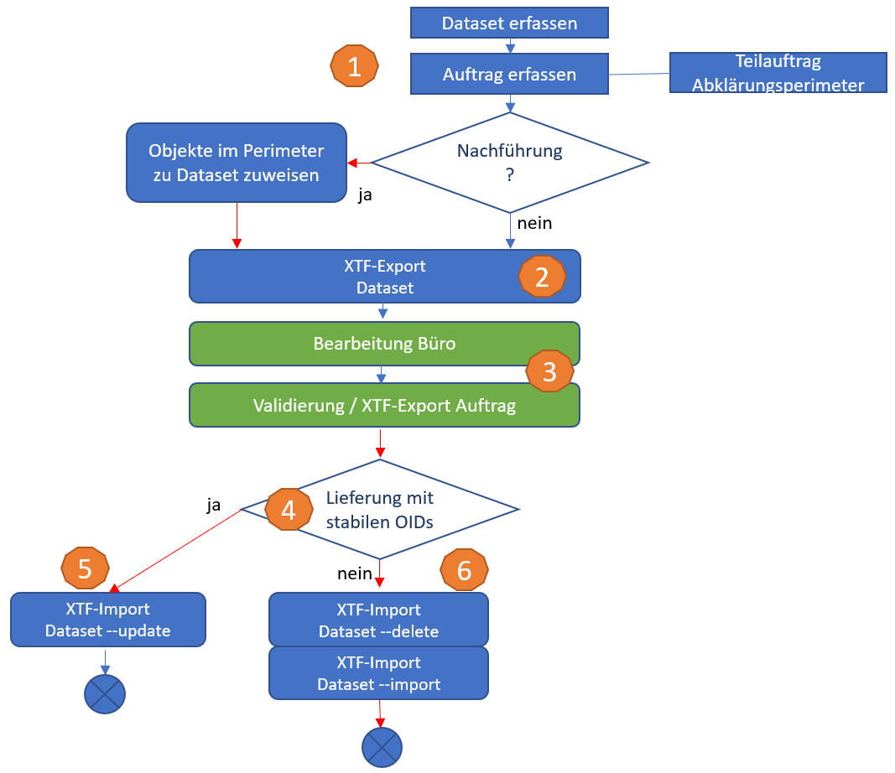
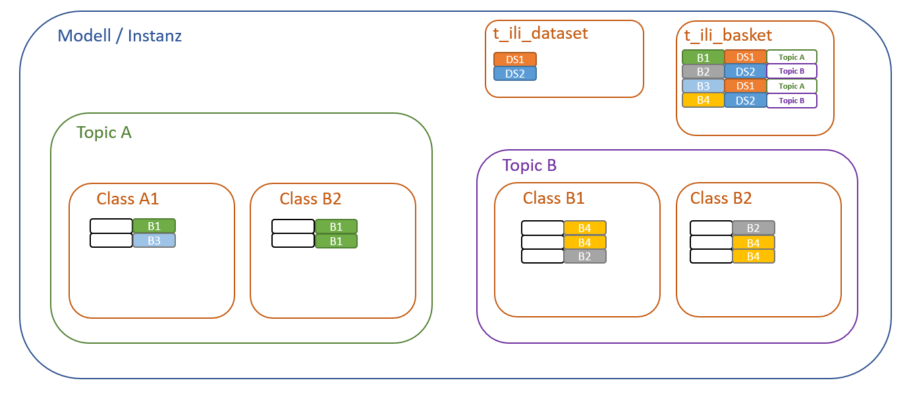
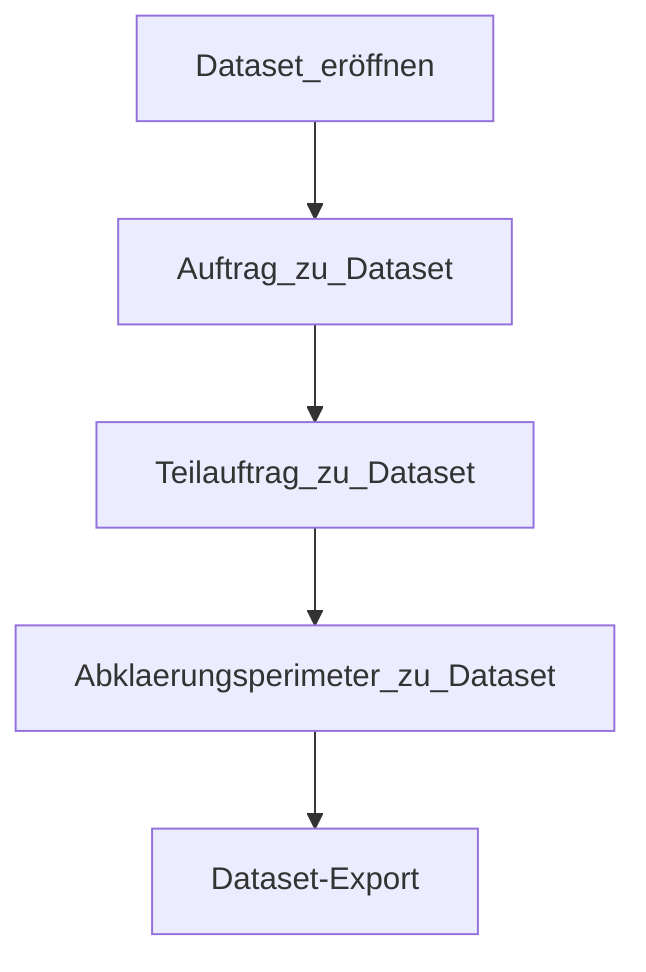

# Beschreibung Datenfluss Datenimport
Diese Dokumentation beschreibt den Datenfluss im Zusammenhang mit der dezentralen Nachführung der Naturgefahrenkarte Solothurn.
Das Grobkonzept sieht vor, dass aus der zentralen Geodaten-Infrastruktur beim Kanton (PostGIS) bestehende Daten exportiert, in Geopackage (GPKG) - Dateien zur dezentralen, verteilten und parallelen Bearbeitung bereitgestellt und in einem kontrollierten Prozess wieder in die GDI überführt werden.

## Ausgangslage: Basket/Dataset-Ergaenzung
Die Master-Instanz ist so zu erweitern, dass einerseits stabile Objektidentifikatoren ausgetauscht und andererseits Datasets und Baskets in der DB verwaltet und zugewiesen werden können:

Ergänzung Topics mit

~~~interlis
    OID AS INTERLIS.UUIDOID;
~~~

> Jek: Nur bei Lieferung mit stabilen ID's notwendig, korrekt?

> Ogr: richtig. Ist hier mir exemplarisch aufgezeigt. Wir wenden einen OID nun nur noch in der abstrakten Klasse TeilauftragRaumbezug an.

PostGIS-Master: Es ist eine BasketCol einzurichten beim Schemaimport unter Verwendung der folgenden Parameter:

~~~cmd
java.exe -jar ili2pg-4.8.0.jar --dbhost *** --dbusr *** --dbpwd **** --dbport *** --dbdatabase NGKSO --schemaimport --createEnumTabs --createNumChecks --createFk --createFkIdx --createGeomIdx --createMetaInfo --createTypeConstraint --createEnumTabsWithId --createTidCol --createBasketCol --smart2Inheritance --strokeArcs --defaultSrsCode 2056 --models SO_AFU_Naturgefahren_20220801 \NGK_SO_V23d_GeoW.ili
~~~

## Übersicht zur Strukturierung mit Baskets und Datasets

Datasets und Baskets sind Organisationselemente, welche es erlauben, dass einzelne Datensätze über Klassen- und Topic-Grenzen hinweg gruppiert werden können. Diese beiden Elemente sind Bestandteil eines Datenbank-Schema's gemäss ili2db-Metamodell.
Eine solche Gruppierung von Datensätzen erlaubt u.a. selektive Daten-exports, -imports oder Datenaktualisierungen (Inkremente).

Diese beiden Möglichkeiten finden im Rahmen des Datenfluss-Konzeptes Verwendung und werden darum hier näher beschrieben.

Im Zusammenhang mit dem Datenfluss bei der NGK SO zwischen Kanton (GDI) und den Datenerfassungsstellen (Büros) ist es vorgesehen, dass einerseits pro Auftrag bzw Projekt ein Dataset eröffnet wird. Zudem werden sämtliche Auftragsmetadaten (Auftrag, Teilauftrag, Bericht) in einem dedizierten Dataset ("Auftragsverwaltung") verwaltet. 
Diesem Dataset 'Auftragsverwaltung' werden mindestens die entsprechenden Datensätze in den Klassen Auftrag und Teilauftrag vorgängig zugewiesen.

Der Umgang mit Datasets ist nur auf Seite GDI notwendig. Die Datenerfassungsstellen benötigen in ihrem System keine Unterstützung stabiler Objektidentifikatoren bzw. Baskets und Datasets.

## Workflow

### 1. Auftrag / Abklärungsperimeter

In QGIS erfolgt die Erfassung der Aufträge, Teilaufträge mit Abklärungsperimeter mit bezug zum Dataset "Auftragsverwaltung". Dieses auftragsneutrale, AfU-interne Dataset enthält explizit Objekte des Datasets 'Auftraege'.

1. Erfassung Dataset und Baskets über Dataset Manager (Model Baker)
2. Auswahl Basket
3. Erfassung Auftrag (siehe Screenshot-1)
4. Erfassung Teilauftrag (TID erhält einen sprechenden Schlüssel mit bezug zum ausführenden Büro, dem Jahr sowie der Auftrags- und Teilauftragsnummer)

Die nun erfassten Objekte sind alle einem Dataset zugewiesen, welche zwar bereitgestellt werden, aber im Rahmen des extern bearbeiteten Auftrags nicht editiert und somit auch nicht überschrieben werden.

Wenn zusätzlich zu den Auftragsdaten weitere Daten im Topic Befunde bzw. Kartographische_Produkte initial erfasst werden, so sind diese einem dedizierten, auftragsbezogenen Dataset ("Auftrag1") zuzuweisen und dann im folgenden Schritt mit zu exportieren.

> Jek: Dies hat mit der Gliederung des Modells in zwei Topics geändert, korrekt?   
Für die Dauer des Auftrages gibt es ein auftragsbezogenes Dataset, damit Korrekturlieferungen vollautomatisch eingespielt werden können (Mittels der Optionen --delete --import)

> Ogr: nein, dies hat nicht geändert. Aufgrund der Anpassung bei der Lieferung geben wir beim Datenimport neben dem --dataset-Parameter auch die --topic-Liste mit. Damit werden die Daten des jeweiligen Datasets und den entsprechenden Topics eingelesen. Daher können sie bei der Datenabgabe auch einem Auftrags-Dataset mitgegeben werden.

### 2. Abgabe Auftragsdaten

Der in der Folge beschriebene Ablauf zeigt die Arbeitsschritte zur Bereitstellung der Datensätze aus der GDI bezogen auf das jeweilige Projekt ("Auftrag1").

1. Export der Auftragsdaten aus PG per Dataset. Die Bereitstellung umfasst auch Objekte des Topics Auftraege über das unter 1) erfasste und befüllte Baseset. Dies erfolgt aus dem Grund, dass die Objektbeziehungen zwischen Auftrag und Prozessquelle stets gültig vorliegt bzw. referenzierbar ist.

~~~cmd
java.exe -jar ili2pg-4.8.0.jar --dbhost *** --dbport *** --dbusr *** --dbpwd *** --dbdatabase NGKSO --dbschema public --export --dataset "Auftragsverwaltung;Auftrag1" --models SO_AFU_Naturgefahren_20220801 /exp-Auftrag1-vorher.xtf
~~~

2. Import der Auftragsdaten in GPKG-Datei

Skript zum Import des Datenextrakts in die GPKG-Datei.
Vorher Dataset und Baskets erstellen! (Dataset Manager)

~~~cmd
java.exe -jar ili2gpkg-4.8.0.jar --update --dbfile /NGKSO2021-Auftrag1-1.gpkg --import --importTid --importBid /exp-Auftrag1-vorher.xtf
~~~

### 3. Bearbeitung Auftrag

Die Bearbeitung des Auftrages erfolgt dezentral und mit beliebigem System.

* Export Datensatz für Datenlieferung (wichtig: keine Schemaänderungen):

~~~cmd
java.exe -jar ili2gpkg-4.8.0.jar --export --dbfile /B3_Dataflow/NGKSO2021-Auftrag1-1.gpkg /exp-Auftrag1-nachher.xtf
~~~

Die INTERLIS-Validierung des Datensatzes kann über die folgenden Werkzeuge erfolgen:

* Upload GPKG-Datei auf ilicop: Rückmeldung der mangelhaften Datensätze und verletzten QS-Regeln mittels log- und xtflog-Datei.
* ili2gpkg mit --validate oder --export Parameter.
* Modelbaker Daten Validator.

### 4. XTF-Import in Master-DB

Beim Import der kontrollierten Daten in die zentrale GDI erfolgt eine Filterung auf das "Auftrags-Dataset", indem zuerst die Elemente dieses Datasets gelöscht und anschliessend neu importiert werden.

~~~cmd
java.exe -jar ili2pg-4.8.0.jar --dbhost *** --dbport *** --dbusr *** --dbpwd *** --dbdatabase NGKSO --dbschema public --delete --dataset Auftrag1
~~~

~~~cmd
java.exe -jar ili2pg-4.8.0.jar --dbhost *** --dbport *** --dbusr *** --dbpwd *** --dbdatabase NGKSO --dbschema public --import --dataset Auftrag1  --topic "SO_AFU_Naturgefahren_20220801.Befunde;SO_AFU_Naturgefahren_20220801.Kartographische_Produkte" --models SO_AFU_Naturgefahren_20220801 /exp-Auftrag1-nachher.xtf
~~~

## Auflösung Dataset

Nach der Übernahme der Daten in die GDI kann das Dataset aus technischer Sicht aufgelöst werden, indem die entsprechenden Objekte ins "Baseset" kopiert werden. Damit tragen sie die implizite Markierung, dass sie nicht mehr in einem Projekt extern der GDI nachgeführt werden.

## offene Punkte / Unklarheiten / Abgrenzungen

* --replace löscht Objekte im Auftrag nicht, trotz Info im Output (<https://github.com/claeis/ili2db/issues/153>)
* Der hier beschriebene Datenfluss unterstützt keine inkrementelle Nachführung bzw. Updates von Datensätzen.
