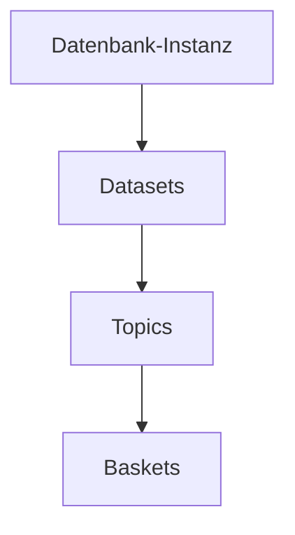

# Beschreibung Datenfluss

## Ausgangslage

PostGIS-Master: BasketCol einrichten:

~~~
java.exe -jar ili2pg-4.8.0.jar --dbhost postgis.geow.cloud --dbusr postgres --dbpwd nC3pVbyJG8NpZiiNuF2Z --dbport 65432 --dbdatabase NGKSO --schemaimport --createEnumTabs --createNumChecks --createFk --createFkIdx --createGeomIdx --createMetaInfo --createTypeConstraint --createEnumTabsWithId --createTidCol --createBasketCol --smart2Inheritance --strokeArcs --defaultSrsCode 2056 --models SO_AFU_Naturgefahren_20220801 \NGK_SO_V23d_GeoW.ili
~~~

## Übersicht

```mermaid
  graph TD;
      PostGIS (Master, Datasets/Baskets aktiviert)-->Verwaltung Auftrag, Teilauftrag, Abklärungsperimeter (zu Dataset)-->Export per Dataset;
```

## 0. Konzept Dataset / Basket

```mermaid
  graph TD;
      Datenbank-Instanz-->Datasets-->Topics-->Baskets;
```

Ergänzung Topics mit
    OID AS INTERLIS.UUIDOID;

## 1. Auftrag / Abklärungsperimeter

Erfassung der Aufträge, Teilaufträge/Abklärungsperimeter mit bezug zu Dataset
Dataset = Auftrag (oder Teilauftrag)

1.Erfassung Dataset und Baskets über Dataset Manager (Model Baker)
2.Einstieg über t_ili2db_dataset
2.Auswahl Basket
3.Erfassung Auftrag (siehe Screenshot-1)
4.Erfassung Teilauftrag

## 2. Abgabe Auftragsdaten

Abgabe der Auftragsdaten per Dataset

1.Export der Auftragsdaten aus PG per Dataset

~~~
java.exe -jar ili2pg-4.8.0.jar --dbhost postgis.geow.cloud --dbport 65432 --dbusr postgres --dbpwd *** --dbdatabase NGKSO --dbschema public --export --dataset "Auftrag1" --models SO_AFU_Naturgefahren_20220801 /exp-Auftrag1-vorher.xtf
~~~

Beispiel: /exp1.xtf

Erstellung GPKG für Aufträge:
~~~
java.exe -jar ili2gpkg-4.8.0.jar --schemaimport --dbfile /NGKSO2021-Auftrag1-1.gpkg --coalesceCatalogueRef --createEnumTabs --createNumChecks --createUnique --createFk --createFkIdx --coalesceMultiSurface --coalesceMultiLine --coalesceMultiPoint --coalesceArray --beautifyEnumDispName --createGeomIdx --createMetaInfo --expandMultilingual --createTypeConstraint --createEnumTabsWithId --createTidCol --smart2Inheritance --strokeArcs --createBasketCol --defaultSrsCode 2056 --models SO_AFU_Naturgefahren_20220801 /NGK_SO_V23d_GeoW.ili
~~~

2.Import der Auftragsdaten in GPKG (Auftrag 1)

Vorher Dataset und Baskets erstellen!! (Dataset Manager)

~~~
java.exe -jar ili2gpkg-4.8.0.jar --import --dbfile /NGKSO2021-Auftrag1-1.gpkg --update --dataset Auftrag1 --disableValidation --importTid --importBid /exp-Auftrag1-vorher.xtf
~~~

## 3.Bearbeitung Auftrag (Auftrag 1)

-Permanente Validierung GPKG über ilicop
-Export Datensatz:
~~~
java.exe -jar ili2gpkg-4.8.0.jar --export --dbfile /B3_Dataflow/NGKSO2021-Auftrag1-1.gpkg --dataset Auftrag1 /exp-Auftrag1-nachher.xtf
~~~

## 4.Import (Update) in Master-DB

Variante: Büro kann stabile OID gewährleisten:

~~~
java.exe -jar "C:\Program Files\INTERLIS\ili2pg\ili2pg-4.8.0.jar" --dbhost ***--dbport *** --dbusr postgres --dbpwd *** --dbdatabase NGKSO --dbschema public --update --dataset "Auftrag1" --disableValidation --models SO_AFU_Naturgefahren_20220801 /exp-Auftrag1-nachher.xtf
~~~

Variante: Büro kann keine stabile OID gewährleisten / Neuerfassung:

~~~
java.exe -jar "C:\Program Files\INTERLIS\ili2pg\ili2pg-4.8.0.jar" --dbhost *** --dbport *** --dbusr postgres --dbpwd nC3pVbyJG8NpZiiNuF2Z --dbdatabase NGKSO --dbschema public --delete --replace --dataset "Auftrag1" --disableValidation --models SO_AFU_Naturgefahren_20220801 /exp-Auftrag1-nachher.xtf
~~~

Problem: --replace löscht Objekte im Auftrag nicht, trotz Info im Output.