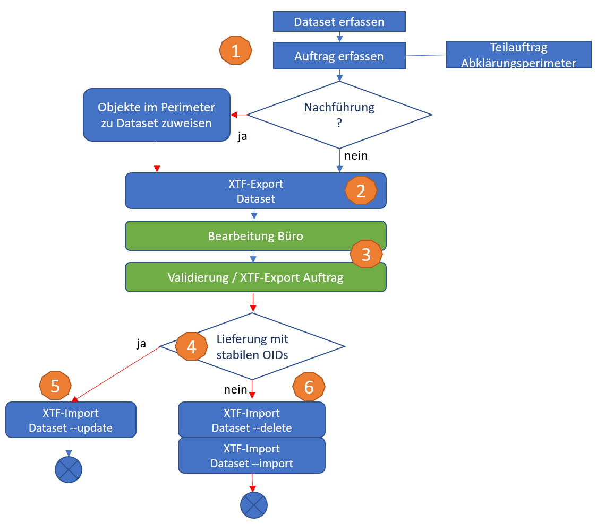

# Beschreibung Datenfluss Datenimport
Diese Dokumentation beschreibt den Datenfluss im Zusammenhang mit der dezentralen Nachführung der Naturgefahrenkarte Solothurn.
Das Grobkonzept sieht vor, dass aus der zentralen Geodaten-Infrastruktur beim Kanton (PostGIS) bestehende Daten exportiert, in Geopackage (GPKG) - Dateien zur dezentralen, verteilten und parallelen Bearbeitung bereitgestellt und in einem kontrollierten Prozess wieder in die GDI überführt werden.

## Ausgangslage: Basket/Dataset-Ergaenzung
Die Master-Instanz ist so zu erweitern, dass einerseits stabile Objektidentifikatoren ausgetauscht und andererseits Datasets und Baskets in der DB verwaltet und zugewiesen werden können:

Ergänzung Topics mit

~~~interlis
    OID AS INTERLIS.UUIDOID;
~~~

PostGIS-Master: Es ist eine BasketCol einzurichten beim Schemaimport unter Verwendung der folgenden Parameter:

~~~cmd
java.exe -jar ili2pg-4.8.0.jar --dbhost *** --dbusr *** --dbpwd **** --dbport *** --dbdatabase NGKSO --schemaimport --createEnumTabs --createNumChecks --createFk --createFkIdx --createGeomIdx --createMetaInfo --createTypeConstraint --createEnumTabsWithId --createTidCol --createBasketCol --smart2Inheritance --strokeArcs --defaultSrsCode 2056 --models SO_AFU_Naturgefahren_20220801 \NGK_SO_V23d_GeoW.ili
~~~

## Übersicht zur Strukturierung mit Baskets und Datasets

Datasets und Baskets sind Organisationselemente, welche es erlauben, dass einzelne Datensätze über Klassen- und Topic-Grenzen hinweg gruppiert werden können. Diese beiden Elemente sind Bestandteil eines Datenbank-Schema's gemäss ili2db-Metamodell.
Eine solche Gruppierung von Datensätzen erlaubt u.a. selektive Datenexports oder Datenaktualisierungen (Inkremente).

Diese beiden Möglichkeiten finden im Rahmen des Datenfluss-Konzeptes Verwendung und werden darum hier näher beschrieben.

Im Zusammenhang mit dem Datenfluss bei der NGK SO zwischen Kanton (GDI) und den Datenerfassungsstellen (Büros) ist es vorgesehen, dass pro Auftrag oder Projekt ein Dataset eröffnet wird.
Diesem werden mindestens die entsprechenden Datensätze in den Klassen Auftrag und Teilauftrag vorgängig zugewiesen.

## Workflow

### 1. Auftrag / Abklärungsperimeter

In QGIS erfolgt die Erfassung der Aufträge, Teilaufträge mit Abklärungsperimeter mit bezug zu Dataset.

1. Erfassung Dataset und Baskets über Dataset Manager (Model Baker)
2. Auswahl Basket
3. Erfassung Auftrag (siehe Screenshot-1)
4. Erfassung Teilauftrag

### 2. Abgabe Auftragsdaten

Der in der Folge beschriebene Ablauf zeigt die Arbeitsschritte zur Bereitstellung der Datensätze aus der GDI bezogen auf das jeweilige Projekt ("Auftrag1").

1. Export der Auftragsdaten aus PG per Dataset

~~~cmd
java.exe -jar ili2pg-4.8.0.jar --dbhost *** --dbport *** --dbusr *** --dbpwd *** --dbdatabase NGKSO --dbschema public --export --dataset "Auftrag1" --models SO_AFU_Naturgefahren_20220801 /exp-Auftrag1-vorher.xtf
~~~

Skript zur Erzeugung des Modellschemas in der GPKG-Datei für die externe Auftragsbearbeitung (Datenextrakts):

~~~cmd
java.exe -jar ili2gpkg-4.8.0.jar --schemaimport --dbfile /NGKSO2021-Auftrag1-1.gpkg --coalesceCatalogueRef --createEnumTabs --createNumChecks --createUnique --createFk --createFkIdx --coalesceMultiSurface --coalesceMultiLine --coalesceMultiPoint --coalesceArray --beautifyEnumDispName --createGeomIdx --createMetaInfo --expandMultilingual --createTypeConstraint --createEnumTabsWithId --createTidCol --smart2Inheritance --strokeArcs --createBasketCol --defaultSrsCode 2056 --models SO_AFU_Naturgefahren_20220801 /NGK_SO_V23d_GeoW.ili
~~~

2. Import der Auftragsdaten in GPKG-Datei

Skript zum Import des Datenextrakts in die GPKG-Datei.
Vorher Dataset und Baskets erstellen! (Dataset Manager)

~~~cmd
java.exe -jar ili2gpkg-4.8.0.jar --update --dbfile /NGKSO2021-Auftrag1-1.gpkg --import --dataset Auftrag1 --importTid --importBid /exp-Auftrag1-vorher.xtf
~~~

### 3. Bearbeitung Auftrag

Die Bearbeitung des Auftrages erfolgt dezentral und mit beliebigem System.

* Export Datensatz für Datenlieferung (wichtig: keine Schemaänderungen):

~~~cmd
java.exe -jar ili2gpkg-4.8.0.jar --export --dbfile /B3_Dataflow/NGKSO2021-Auftrag1-1.gpkg --dataset Auftrag1 /exp-Auftrag1-nachher.xtf
~~~

Die INTERLIS-Validierung des Datensatzes kann über die folgenden Werkzeuge erfolgen:

* Upload GPKG-Datei auf ilicop: Rückmeldung der mangelhaften Datensätze und verletzten QS-Regeln mittels log- und xtflog-Datei.
* ili2gpkg mit --validate oder --export Parameter.
* Modelbaker Daten Validator.

### 4. XTF-Import in Master-DB

Beim Import der Daten in die zentrale GDI beim Kanton sind die folgenden beiden Varianten zu beachten.
Wichtig ist der Hinweis, dass es sich hier in beiden Fällen um vorgängig kontrollierte Datensätze handelt.

**Variante 1:** Das System des Datenlieferanten kann stabile OID liefern (Fall 5). Damit ist gewährleistet, dass die Datensätze "wiedererkannt" und entsprechend aktualisiert werden können.
In diesem Fall erfolgt der Import des Inkrements mittels der --update-Anweisung und in bezug auf das entsprechende Dataset:

~~~cmd
java.exe -jar ili2pg-4.8.0.jar --dbhost *** --dbport *** --dbusr *** --dbpwd *** --dbdatabase NGKSO --dbschema public --update --dataset Auftrag1 --models SO_AFU_Naturgefahren_20220801 /exp-Auftrag1-nachher.xtf
~~~

**Variante 2:** Der Datenlieferant kann keine stabile OID gewährleisten (Fall 6). Die importierten Objekte tragen im Vergleich zu allfällig bereits in der Datenbank existierenden, entsprechenden Datensätze neue Identifikatoren. Eine Erkennung ist damit nicht möglich. In diesem Fall sind die bestehenden Daten des entsprechenden Datasets vorgängig in der GDI zu löschen (--delete - Anweisung).

~~~cmd
java.exe -jar ili2pg-4.8.0.jar --dbhost *** --dbport *** --dbusr *** --dbpwd *** --dbdatabase NGKSO --dbschema public --delete --dataset Auftrag1
~~~

~~~cmd
java.exe -jar ili2pg-4.8.0.jar --dbhost *** --dbport *** --dbusr *** --dbpwd *** --dbdatabase NGKSO --dbschema public --import --dataset Auftrag1 --models SO_AFU_Naturgefahren_20220801 /exp-Auftrag1-nachher.xtf
~~~

## Auflösung Dataset

Nach der Übernahme der Daten in die GDI kann das Dataset aus technischen Gründen aufgelöst werden, indem die entsprechenden Objekte ins "Baseset" kopiert werden. Damit tragen sie die Markierung, dass sie nicht mehr in einem Projekt extern der GDI nachgeführt werden.

## offene Punkte / Unklarheiten

* --replace löscht Objekte im Auftrag nicht, trotz Info im Output (<https://github.com/claeis/ili2db/issues/153>)
