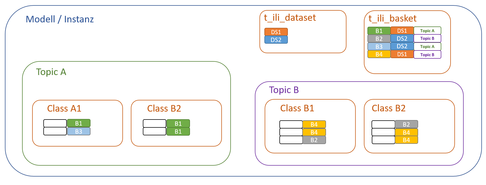

# Beschreibung Datenfluss
Diese Dokumentation beschreibt den Datenfluss im Zusammenhang mit der dezentralen Nachführung der Naturgefahrenkarte Solothurn.

## Ausgangslage: Basket/Dataset-Ergaenzung
Die Master-Instanz ist so zu erweitern, dass einerseits stabile Objektidentifikatoren ausgetauscht und andererseits Datasets und Baskets in der DB verwaltet und zugewiesen werden können:

Ergänzung Topics mit
    OID AS INTERLIS.UUIDOID;

PostGIS-Master: Es ist eine BasketCol einzurichten beim Schemaimport unter Verwendung der folgenden Parameter:

~~~
java.exe -jar ili2pg-4.8.0.jar --dbhost *** --dbusr *** --dbpwd **** --dbport *** --dbdatabase NGKSO --schemaimport --createEnumTabs --createNumChecks --createFk --createFkIdx --createGeomIdx --createMetaInfo --createTypeConstraint --createEnumTabsWithId --createTidCol --createBasketCol --smart2Inheritance --strokeArcs --defaultSrsCode 2056 --models SO_AFU_Naturgefahren_20220801 \NGK_SO_V23d_GeoW.ili
~~~

Übersicht zur Strukturierung mit Baskets und Datasets:

## Workflow

### 1. Auftrag / Abklärungsperimeter

Erfassung der Aufträge, Teilaufträge/Abklärungsperimeter mit bezug zu Dataset in QGIS
Dataset = freie Organisationsgrösse. zB. Büro, Auftrag oder Teilauftrag

1.Erfassung Dataset und Baskets über Dataset Manager (Model Baker)
2.Auswahl Basket
3.Erfassung Auftrag (siehe Screenshot-1)
4.Erfassung Teilauftrag

### 2. Abgabe Auftragsdaten

Abgabe der Auftragsdaten per Dataset

1.Export der Auftragsdaten aus PG per Dataset

~~~cmd
java.exe -jar ili2pg-4.8.0.jar --dbhost *** --dbport *** --dbusr *** --dbpwd *** --dbdatabase NGKSO --dbschema public --export --dataset "Auftrag1" --models SO_AFU_Naturgefahren_20220801 /exp-Auftrag1-vorher.xtf
~~~

Beispiel: /exp1.xtf

Erstellung Modellschema in GPKG-Datei für Aufträge:

~~~cmd
java.exe -jar ili2gpkg-4.8.0.jar --schemaimport --dbfile /NGKSO2021-Auftrag1-1.gpkg --coalesceCatalogueRef --createEnumTabs --createNumChecks --createUnique --createFk --createFkIdx --coalesceMultiSurface --coalesceMultiLine --coalesceMultiPoint --coalesceArray --beautifyEnumDispName --createGeomIdx --createMetaInfo --expandMultilingual --createTypeConstraint --createEnumTabsWithId --createTidCol --smart2Inheritance --strokeArcs --createBasketCol --defaultSrsCode 2056 --models SO_AFU_Naturgefahren_20220801 /NGK_SO_V23d_GeoW.ili
~~~

2.Import der Auftragsdaten in GPKG-Datei (Auftrag 1)

Vorher Dataset und Baskets erstellen! (Dataset Manager)

~~~cmd
java.exe -jar ili2gpkg-4.8.0.jar --update --dbfile /NGKSO2021-Auftrag1-1.gpkg --update --dataset Auftrag1 --importTid --importBid /exp-Auftrag1-vorher.xtf
~~~

?? Oder per --import dafür ohne vorgängige Erfassung??

### 3. Bearbeitung Auftrag (Auftrag 1)

Dezentrale Bearbeitung des Auftrages mit beliebigem System.

-Export Datensatz für Datenlieferung (wichtig: keine Schemaänderungen):

~~~cmd
java.exe -jar ili2gpkg-4.8.0.jar --export --dbfile /B3_Dataflow/NGKSO2021-Auftrag1-1.gpkg --dataset Auftrag1 /exp-Auftrag1-nachher.xtf
~~~

Validierung über:
-Upload GPKG-Datei auf ilicop
-ili2gpkg mit --validate oder--export Parameter

### 4. XTF-Import in Master-DB (Nachführungs- oder Neuerfassungsaufträge)

Variante: Büro kann stabile OID liefern (Fall 5):

~~~cmd
java.exe -jar ili2pg-4.8.0.jar --dbhost *** --dbport *** --dbusr *** --dbpwd *** --dbdatabase NGKSO --dbschema public --update --dataset Auftrag1 --models SO_AFU_Naturgefahren_20220801 /exp-Auftrag1-nachher.xtf
~~~

Variante: Büro kann keine stabile OID gewährleisten (Fall 6):

~~~cmd
java.exe -jar ili2pg-4.8.0.jar --dbhost *** --dbport *** --dbusr *** --dbpwd *** --dbdatabase NGKSO --dbschema public --delete --import --dataset Auftrag1 --models SO_AFU_Naturgefahren_20220801 /exp-Auftrag1-nachher.xtf
~~~

Problem: --replace löscht Objekte im Auftrag nicht, trotz Info im Output.

