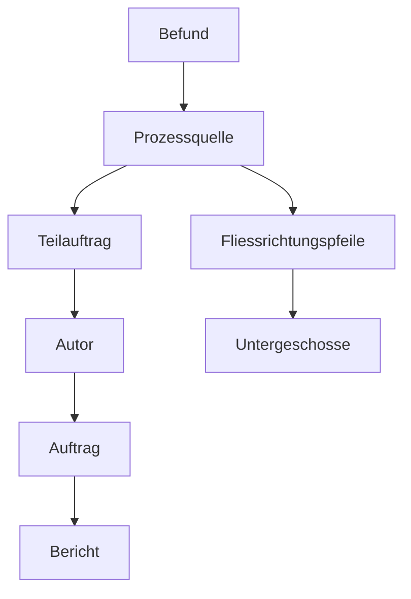
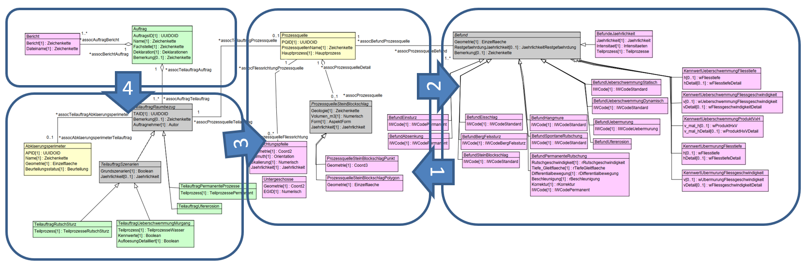

# p-naturgefahren-ili: Review des Fachmodells

## Formale Aspekte ili Modellbeschreibung

### Aufbau der ILI-Datei

* Codierung 'UTF-8 ohne BOM' führt zu Lesefehler bei ilitools: korrigiert
* tendenziell etwas überkommentiert. Kommentare, welche die ILI Syntax repetieren, entfernt.
* Header, Revision-History AGI Solothurn fehlt
* Issuer auf geo.so.ch/models/AFU gesetzt
* VERSION aktualisiert
* Indentation vereinheitlicht und angepasst

### Betitelung der Objekte

* Topic Auftrag: besser Plural
* Enum Teilprozesse: besser Singular
* Enum: Intensitaeten: besser Singular
* Association: Regel mit Präfix 'assoc' ungewöhnlich: besser 'r'
* Klasse Fliessrichtungspfeile: besser Singular
* Klasse Untergeschosse: besser Singular

## Syntaktische Aspekte ili Modellbeschreibung

* IMPORTS von INTERLIS muss nicht explizit aufgeführt werden.
* IMPORTS Basismodelle auf UNQUALIFIED gesetzt
* Optimierung: Verwendung von Einheiten im Eigenschaftsnamen (zB. "ProzessquelleSteinBlockschlag.Volumen_m3") wird besser mittels konkreter Typisierung gelöst. !!TODO (Abhängigkeit zu MGDM)
* UNIQUE Constraint auf Prozessquelle (sinnvoll aufgrund der Erfassungsmethodik über Prozessquelle)
* die beiden Structures sind sinnvoll gewählt
* Kartographische_Produkte.Untergeschosse.EGID Nummernbereich angepasst (gemäss DM.flex). Alter Nummernbereich führte zu Fehler in GPKG (Nummernbereich zu gross dimensioniert, Eigenschaft kann nicht erfasst werden)
* Ansonsten enthält das Modell keine Elemente, welche per se von ili2gpkg oder Geopackage aktuell nicht unterstützt werden.
* Abklaerungsperimeter neu 1:1 zu Teilauftrag zugewiesen (Constraint Req.30). Daher Attribute in Klasse TeilauftragRaumbezug integriert.
* Explizite Objekt-Identifikatoren in Klassen Auftrag.Autor (ID), Auftrag (AuftragsID) , Prozessquelle (PQID), TeilauftragRaumbezug (APID, TAID) entfernt. Sind für inkrementellen Datenaustausch nicht notwendig.
* In den Klassen Kennwertxxx fehlt ein Bezug zur Jaehrlichkeit. Daher Attribut:

~~~
Jaehrlichkeit : JaehrlichkeitListe;
~~~

ergänzt.

* Stabile Objekt-Identifikatoren eingefügt für Basket/Dataset-Handling:

~~~
OID AS INTERLIS.UUIDOID;
~~~

## Erfassungsprozess QGIS

### Erfassungsreihenfolge

1. Vorbereitung: Erfassung Auftrag - Bericht / Erfassung Abklerungsperimeter / Erfassung Autor
2. Stein- / Blockschlag Prozesse: Einstieg auf ProzessquellePolygon bzw. -Punkt ()
3. alle anderen Prozesse: Einstieg auf Prozessquelle
4. Erfassung Teilauftrag XY und Zuweisung Autor
5. Zuordnung Auftrag (Bericht)
6. Erfassung Befund
7. Erfassung Fliessrichtungspfeile
8. Erfassung Untergeschosse

### Verschiedene Hinweise

* TeilAuftragRutschSturz kriegt von ModelBaker (v7.1.7) auch Beziehungselemente zu den anderen TeilAuftrags-Klassen. Dies ist falsch und muss im Fall einer ModelBaker-Verwendung korrigiert werden.
* Drehwinkel (zB. Richtungspfeile): Aktuell über Eingabe des Azimut-Wertes, Symbolisierung variabel -> Kontrolle